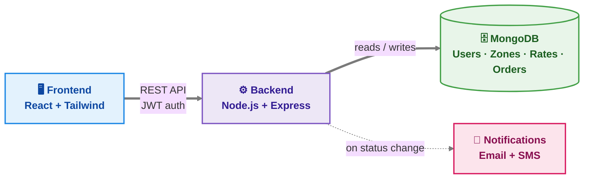
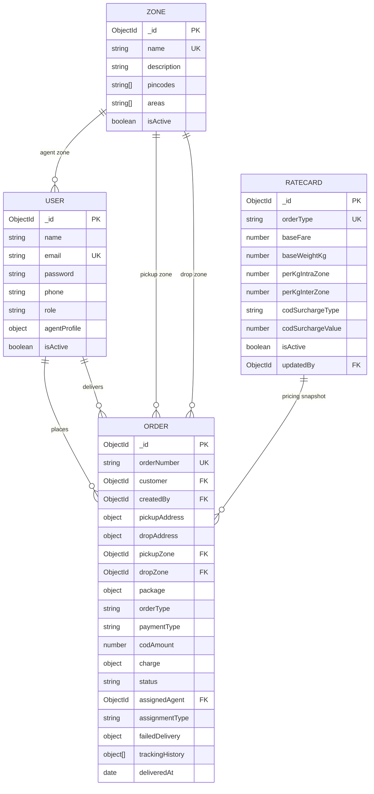

<div align="center">

# 📦 Last-Mile Delivery Tracker

A full-stack **MERN** delivery management platform for managing customers, delivery agents, orders, pricing, tracking, assignments, and delivery notifications.

Customers and admins can create orders with **auto-calculated shipping charges**, while delivery agents can manage assigned shipments and update delivery status. The system supports intelligent **nearest-agent auto-assignment**, manual assignment, failed-delivery rescheduling, and customer notifications.

[**🌐 Live App**](https://lastmile-delivery-tracker-kyyq-ks6zhgjn2-vaishnavi-0c1c.vercel.app/)


**[🔗 Live App](#-live-demo) · [✨ Features](#-features) · [🏗 Architecture](#-architecture) · [🗄 Database Schema](#-database-schema) · [⚙️ Environment Variables](#️-environment-variables) · [🚀 Local Setup](#-local-setup)**

</div>

---

## 🔗 Live Demo

| Part           | URL                                                                                                       | Hosted On        |
| -------------- | --------------------------------------------------------------------------------------------------------- | ---------------- |
| 🌐 Frontend    | [Last-Mile Delivery Tracker](https://lastmile-delivery-tracker-kyyq-ks6zhgjn2-vaishnavi-0c1c.vercel.app/) | Vercel           |
| ⚙️ Backend API | Configured through the deployed frontend environment                                                      | Render / Railway |

### 🔐 Demo Accounts

| Role        | Email                      | Password         |
| ----------- | -------------------------- | ---------------- |
| 🛡️ Admin   | `admin@lastmile.com`       | `Admin@12345`    |
| 🚴 Agent    | `ravi.agent@lastmile.com`  | `Agent@12345`    |
| 🚴 Agent    | `priya.agent@lastmile.com` | `Agent@12345`    |
| 👤 Customer | `customer@lastmile.com`    | `Customer@12345` |

> **Note:** Demo credentials are intended for testing the deployed application. Change seeded passwords before using the system in a real production environment.

---

## 📸 Screenshots

A few screens from the running application:

| **Login Page**                               | **Customer — New Order**                                     |
| -------------------------------------------- | ------------------------------------------------------------ |
|  |  |

| **Customer — My Orders**                                     | **Customer — Multiple Orders**                                              |
| ------------------------------------------------------------ | --------------------------------------------------------------------------- |
|  |  |

| **Delivery Agent Dashboard**                                             | **Admin — Order Management**                                         |
| ------------------------------------------------------------------------ | -------------------------------------------------------------------- |
|  |  |

---

## ✨ Features

### 👤 Customer

* Register and login with JWT-based authentication
* Create orders with live shipping-price preview
* View calculated shipping charges before confirming an order
* Track order status using a visual timeline
* View current and previous orders
* View frozen price breakdown for historical orders
* Request rescheduling after a failed delivery attempt
* Receive email/SMS notifications on order-status changes

### 🚴 Delivery Agent

* View assigned delivery orders
* Update order status through a validated status pipeline
* Mark deliveries as failed with a reason
* Toggle agent availability
* Update current location for intelligent auto-assignment
* Automatically receive reassigned orders after rescheduling

### 🛡️ Admin

* View and manage all orders
* Manually assign or reassign delivery agents
* Manage logistics zones
* Manage B2B/B2C rate cards
* Manage customers and delivery agents
* Activate/deactivate users
* Monitor auto-assignment and widened-search conditions
* View order tracking history

### ⚙️ Platform-wide

* 🧮 **Dynamic pricing engine**

  * Volumetric weight
  * Billable weight
  * Intra-zone pricing
  * Inter-zone pricing
  * COD surcharge
  * Database-driven rate cards

* 🤖 **Smart auto-assignment**

  * Nearest available agent
  * Haversine-distance calculation
  * Load-balancing fallback
  * System-wide search when a zone has no available agents

* 🔁 **Failed delivery and reschedule flow**

  * Failure reason tracking
  * Customer rescheduling
  * Automatic reassignment
  * Re-entry into the delivery workflow

* 🧾 **Append-only tracking history**

  * Timestamped status changes
  * Actor attribution
  * Complete order audit trail

* 📧 **Email + SMS notifications**

  * Nodemailer
  * Twilio
  * Dry-run mode for local development

* 🔒 **Role-based access control**

  * Customer
  * Delivery Agent
  * Admin

* ✅ **Automated testing**

  * Jest
  * Supertest
  * MongoDB Memory Server
  * Rate-engine unit tests
  * Order-lifecycle integration tests

---

## 🏗 Architecture



### Request Flow — Creating an Order

```text
Customer Dashboard
        ↓
POST /api/orders/preview
        ↓
Zone Detector
        ↓
Rate Calculator
        ↓
Volumetric Weight
        ↓
Billable Weight
        ↓
Charge Calculation
        ↓
Price Preview
        ↓
POST /api/orders
        ↓
Server-side Recalculation
        ↓
Auto Assignment
        ↓
Order + Frozen Charge Snapshot
        ↓
Tracking History
        ↓
Customer Notification
```

The price is always recalculated on the server during order creation. The backend never trusts a price supplied by the frontend.

---

## ⚙️ Environment Variables

### Backend — `backend/.env`

| Variable                | Example                                     | Purpose                                       |
| ----------------------- | ------------------------------------------- | --------------------------------------------- |
| `PORT`                  | `5000`                                      | Port used by the Express server               |
| `NODE_ENV`              | `development`                               | Application environment                       |
| `CLIENT_URL`            | `http://localhost:5173`                     | Frontend URL used for CORS                    |
| `MONGO_URI`             | `mongodb://127.0.0.1:27017/lastmile`        | MongoDB connection string                     |
| `JWT_SECRET`            | `your-long-random-secret`                   | JWT signing secret                            |
| `JWT_EXPIRES_IN`        | `7d`                                        | JWT expiration period                         |
| `SMTP_HOST`             | `smtp.gmail.com`                            | SMTP server                                   |
| `SMTP_PORT`             | `587`                                       | SMTP port                                     |
| `SMTP_SECURE`           | `false`                                     | SMTP TLS configuration                        |
| `SMTP_USER`             | `your_email@gmail.com`                      | SMTP username                                 |
| `SMTP_PASS`             | `your_app_password`                         | SMTP password/app password                    |
| `EMAIL_FROM`            | `Last-Mile Tracker <no-reply@lastmile.com>` | Notification sender                           |
| `TWILIO_ACCOUNT_SID`    | `ACxxxxxxxxxxxxxxxx`                        | Twilio account ID                             |
| `TWILIO_AUTH_TOKEN`     | `your_twilio_auth_token`                    | Twilio authentication token                   |
| `TWILIO_PHONE_NUMBER`   | `+1xxxxxxxxxx`                              | Twilio sender number                          |
| `NOTIFICATIONS_DRY_RUN` | `true`                                      | Disable real notifications during development |
| `SEED_ADMIN_EMAIL`      | `admin@lastmile.com`                        | Seed admin email                              |
| `SEED_ADMIN_PASSWORD`   | `Admin@12345`                               | Seed admin password                           |

### Frontend — `frontend/.env`

| Variable            | Example                     | Purpose              |
| ------------------- | --------------------------- | -------------------- |
| `VITE_API_BASE_URL` | `http://localhost:5000/api` | Backend API base URL |

> Copy `.env.example` to `.env` in both the backend and frontend directories.
>
> Never commit real `.env` files, passwords, API keys, JWT secrets, SMTP credentials, or Twilio credentials.

---

## 🗄 Database Schema

The application uses MongoDB with Mongoose.

There are four main collections:

* `User`
* `Zone`
* `RateCard`
* `Order`

`Order` is the central document and references customers, delivery agents, zones, and the rate card used during order creation.



### Collection Reference

| Collection   | Purpose                                                                        |
| ------------ | ------------------------------------------------------------------------------ |
| **User**     | Stores customers, delivery agents, and administrators                          |
| **Zone**     | Maps pincodes and areas to logistics zones                                     |
| **RateCard** | Stores B2B/B2C pricing configuration                                           |
| **Order**    | Stores shipment information, pricing, assignment, status, and tracking history |

### Order Price Snapshot

When an order is created, its calculated charge is frozen.

This means changing a rate card later **does not change the price of an existing order**.

---

## 🧮 Rate Calculation Logic

### 1. Zone Detection

Pickup and drop locations are mapped to logistics zones using:

* Pincode
* Area
* City fallback

### 2. Volumetric Weight

```text
Volumetric Weight =
(L × B × H) / 5000
```

Dimensions are measured in centimeters.

### 3. Billable Weight

```text
Billable Weight =
MAX(Actual Weight, Volumetric Weight)
```

### 4. Rate Card

The active rate card is selected based on:

```text
B2B
or
B2C
```

### 5. Weight Charge

```text
Weight Charge =
MAX(0, Billable Weight - Base Weight)
× Applicable Per-Kg Rate
```

The applicable rate depends on whether the shipment is:

```text
Intra-Zone
or
Inter-Zone
```

### 6. COD Surcharge

COD surcharge is added only when:

```text
Payment Type = COD
```

The surcharge can be:

* Flat amount
* Percentage

### 7. Total Charge

```text
Total =
Base Fare
+ Weight Charge
+ COD Surcharge
```

The same calculation is performed again on the backend when the order is confirmed.

---

## 🤖 Auto-Assignment Logic

The delivery agent assignment system works as follows:

### Step 1 — Find Available Agents

The system searches for agents who are:

```text
isAvailable = true
```

and preferably belong to the pickup zone.

### Step 2 — Calculate Distance

If agents have current location data, the system calculates distance using the **Haversine formula**.

### Step 3 — Load Balancing

If multiple agents are suitable, the system considers:

```text
activeOrderCount
```

to balance delivery workloads.

### Step 4 — Widened Search

If no available agent exists in the pickup zone, the search expands system-wide.

The response records:

```text
widenedSearch = true
```

### Step 5 — Assignment

The selected agent is assigned to the order and their active order count is updated.

---

## 🔁 Failed Delivery & Reschedule Flow

```text
Agent
  ↓
Marks Delivery as Failed
  ↓
Failure Reason Stored
  ↓
Customer Notification
  ↓
Customer/Admin Requests Reschedule
  ↓
Order → Rescheduled
  ↓
Auto Assignment Runs Again
  ↓
New Agent Assignment
  ↓
Picked Up
  ↓
In Transit
  ↓
Out for Delivery
  ↓
Delivered / Failed
```

Every status change is stored in the order's append-only `trackingHistory`.

---

## 🧰 Tech Stack

| Layer              | Technology                                        |
| ------------------ | ------------------------------------------------- |
| **Frontend**       | React 18, Vite, React Router, Tailwind CSS, Axios |
| **Backend**        | Node.js, Express 4                                |
| **Database**       | MongoDB, Mongoose 8                               |
| **Authentication** | JWT, bcryptjs                                     |
| **Notifications**  | Nodemailer, Twilio                                |
| **Security**       | Helmet, express-rate-limit, express-validator     |
| **Testing**        | Jest, Supertest, mongodb-memory-server            |
| **Deployment**     | Vercel, Render/Railway, MongoDB Atlas             |

---

## 📁 Project Structure

```text
lastmile-delivery-tracker/
│
├── backend/
│   ├── config/
│   │   └── db.js
│   │
│   ├── models/
│   │   ├── User.js
│   │   ├── Zone.js
│   │   ├── RateCard.js
│   │   └── Order.js
│   │
│   ├── controllers/
│   │   ├── authController.js
│   │   ├── zoneController.js
│   │   ├── rateCardController.js
│   │   ├── orderController.js
│   │   └── userController.js
│   │
│   ├── routes/
│   │   ├── auth.js
│   │   ├── zones.js
│   │   ├── rateCards.js
│   │   ├── orders.js
│   │   └── users.js
│   │
│   ├── middleware/
│   │   ├── auth.js
│   │   ├── role.js
│   │   └── errorHandler.js
│   │
│   ├── utils/
│   │   ├── rateCalculator.js
│   │   ├── zoneDetector.js
│   │   ├── autoAssign.js
│   │   └── notificationService.js
│   │
│   ├── seed/
│   │   └── seed.js
│   │
│   ├── tests/
│   │   ├── rateCalculator.test.js
│   │   └── orderLifecycle.test.js
│   │
│   ├── server.js
│   ├── package.json
│   └── .env.example
│
├── frontend/
│   ├── src/
│   │   ├── api/
│   │   ├── context/
│   │   │   └── AuthContext.jsx
│   │   ├── components/
│   │   └── pages/
│   │
│   ├── package.json
│   └── .env.example
│
├── screenshots/
│   ├── 01-login-page.png
│   ├── 02-customer-new-order.png
│   ├── 03-customer-my-orders.png
│   ├── 04-customer-my-orders-multiple.png
│   ├── 05-delivery-agent-dashboard.png
│   └── 06-admin-order-management.png
│
├── SYSTEM_DESIGN.md
├── API_DOCUMENTATION.md
└── README.md
```

---

## 🚀 Local Setup

### Prerequisites

Install:

* Node.js 18+
* MongoDB or MongoDB Atlas
* Git
* npm

Optional:

* SMTP account
* Twilio account

For local development without notification credentials, use:

```env
NOTIFICATIONS_DRY_RUN=true
```

---

### Backend

```bash
cd backend

cp .env.example .env
```

Edit `.env` and configure:

```env
MONGO_URI=your_mongodb_connection_string
JWT_SECRET=your_secret_key
CLIENT_URL=http://localhost:5173
```

Then install dependencies:

```bash
npm install
```

Seed the database:

```bash
npm run seed
```

Start the backend:

```bash
npm run dev
```

Backend:

```text
http://localhost:5000
```

---

### Frontend

Open another terminal:

```bash
cd frontend

cp .env.example .env
```

Set:

```env
VITE_API_BASE_URL=http://localhost:5000/api
```

Install dependencies:

```bash
npm install
```

Start the frontend:

```bash
npm run dev
```

Frontend:

```text
http://localhost:5173
```

---

## 🔐 Login Credentials

After running the seed script:

### Admin

```text
Email: admin@lastmile.com
Password: Admin@12345
```

### Delivery Agent

```text
Email: ravi.agent@lastmile.com
Password: Agent@12345
```

### Second Delivery Agent

```text
Email: priya.agent@lastmile.com
Password: Agent@12345
```

### Customer

```text
Email: customer@lastmile.com
Password: Customer@12345
```

You can also register a new customer from the application.

---

## 🧪 Running Tests

Run backend tests:

```bash
cd backend
npm test
```

The test suite uses:

```text
Jest
Supertest
mongodb-memory-server
```

Tests cover:

* Volumetric weight calculation
* Billable weight calculation
* Intra-zone pricing
* Inter-zone pricing
* COD surcharge
* Order creation
* Agent assignment
* Status transitions
* Failed delivery
* Rescheduling
* Auto reassignment
* Admin override

---

## 📡 API Reference

Detailed API documentation is available in:

```text
API_DOCUMENTATION.md
```

The backend exposes REST APIs under:

```text
/api
```

Examples:

```text
POST   /api/auth/register
POST   /api/auth/login

POST   /api/orders/preview
POST   /api/orders
GET    /api/orders
GET    /api/orders/:id

PATCH  /api/orders/:id/status
POST   /api/orders/:id/reschedule

GET    /api/zones
POST   /api/zones

GET    /api/rate-cards
PATCH  /api/rate-cards/:id
```

---

## ☁️ Deployment

### Database

Use MongoDB Atlas for the production database.

Configure:

```text
MONGO_URI
```

with your MongoDB Atlas connection string.

---

### Backend

The backend can be deployed using:

* Render
* Railway

Typical configuration:

```text
Build Command:
npm install

Start Command:
npm start
```

Configure all variables from:

```text
backend/.env.example
```

After deployment, run:

```bash
npm run seed
```

once to create the initial configuration and accounts.

---

### Frontend

The frontend is deployed on Vercel.

Production application:

**https://lastmile-delivery-tracker-kyyq-ks6zhgjn2-vaishnavi-0c1c.vercel.app/**

Set the Vercel environment variable:

```env
VITE_API_BASE_URL=YOUR_DEPLOYED_BACKEND_URL/api
```

The backend `CLIENT_URL` should point to:

```text
https://lastmile-delivery-tracker-kyyq-ks6zhgjn2-vaishnavi-0c1c.vercel.app
```

---

## 🔒 Security Notes

* Passwords are hashed using bcrypt.
* JWT authentication protects private routes.
* Role-based middleware protects customer, agent, and admin functionality.
* Rate limiting is enabled for API protection.
* Helmet is used for HTTP security headers.
* Environment secrets are not committed to Git.
* Backend recalculates order prices instead of trusting frontend values.
* Order tracking history is append-only.

---

## 📝 Notes

* Pricing is database-driven through `RateCard`.
* Zones are managed through the admin dashboard.
* Historical order prices remain unchanged after rate-card updates.
* Auto-assignment uses agent availability, location, and active workload.
* Failed deliveries support rescheduling and reassignment.
* The frontend communicates with the real backend REST APIs.
* Seed data is provided for demonstration and development.
* Notification dry-run mode allows the application to run without SMTP or Twilio credentials.

---

## 🌐 Live Application

### 🚀 Try the deployed application

**[Open Last-Mile Delivery Tracker →](https://lastmile-delivery-tracker-kyyq-ks6zhgjn2-vaishnavi-0c1c.vercel.app/)**

---

<div align="center">

Built with ❤️ using the **MERN Stack**

**Last-Mile Delivery Tracker**

</div>
