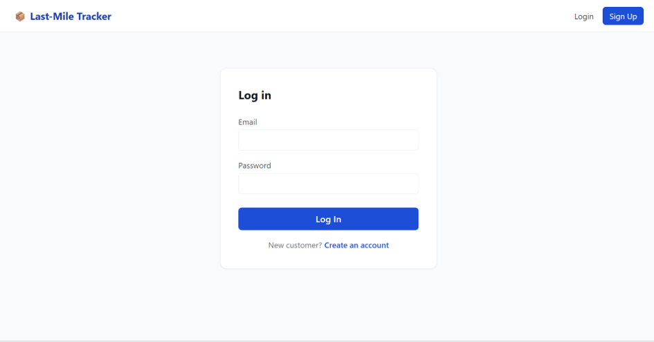
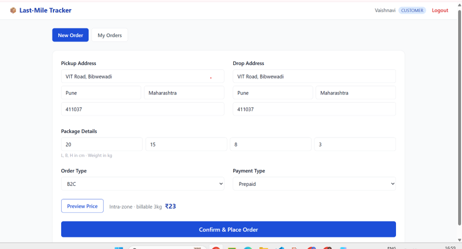
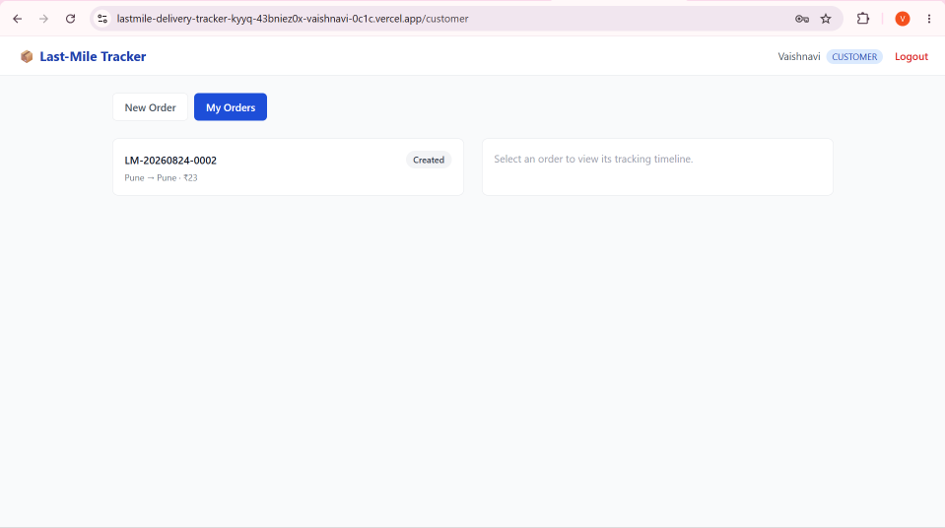
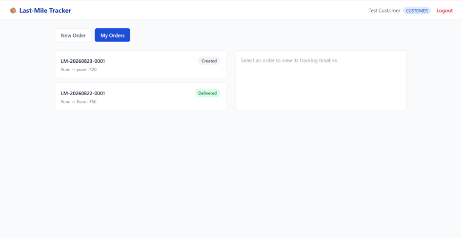
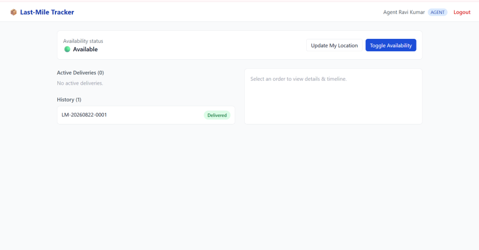
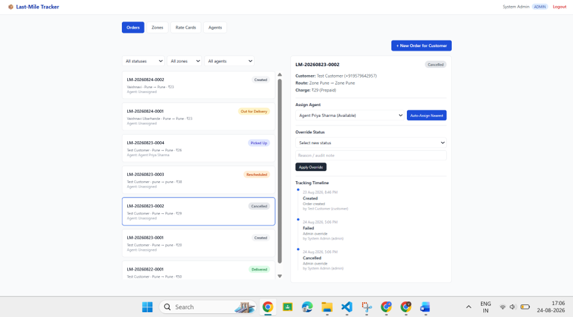

# 📦 Last-Mile Delivery Tracker

A full-stack **MERN-based delivery management platform** for managing customers, delivery agents, orders, pricing, tracking, assignments, and delivery notifications.

The system supports **Customer, Delivery Agent, and Admin** roles with JWT authentication and role-based access control.

---

## 🔗 Live Demo

### 🚀 App Demo

**Live Application:**
https://lastmile-delivery-tracker-frontend-g39dcb042-vaishnavi-0c1c.vercel.app/login

The application is deployed on **Vercel**.

---

## ✨ Key Features

### 👤 Customer

* Register and login securely using JWT authentication
* Create delivery orders
* Enter pickup and delivery addresses
* Get shipping price preview before confirming an order
* Track order status using a visual timeline
* View previous orders
* View complete price breakdown
* Request rescheduling after failed delivery
* Receive delivery status notifications

### 🚴 Delivery Agent

* Login using an agent account
* View assigned orders
* Update delivery status
* Mark deliveries as failed with a reason
* Update availability
* Update current location
* Participate in automatic order assignment

### 🛡️ Admin

* View and manage all orders
* Manually assign or reassign delivery agents
* Manage delivery zones
* Manage B2B/B2C rate cards
* Manage customers and delivery agents
* Monitor agent availability
* Monitor order status and tracking history
* Override assignments when required

### ⚙️ Platform

* JWT authentication
* Role-based authorization
* Dynamic shipping price calculation
* Volumetric weight calculation
* Intra-zone and inter-zone pricing
* COD surcharge calculation
* Nearest-agent auto assignment
* Agent load balancing
* Failed delivery and rescheduling
* Email and SMS notification support
* Append-only order tracking history
* REST API
* Jest and Supertest testing

---

## 📸 Screenshots

### Login



### Customer — New Order



### Customer — My Orders



### Customer — Multiple Orders



### Delivery Agent Dashboard



### Admin — Order Management



---

## 🏗️ System Architecture

The application follows a three-layer full-stack architecture:

```text
Customer / Delivery Agent / Admin
              |
              v
       React Frontend
              |
              v
      Node.js + Express
              |
              v
          MongoDB
              |
              v
    Email + SMS Notifications
```

---

## 🧮 Rate Calculation

The application dynamically calculates shipping charges using:

* Actual package weight
* Volumetric weight
* Billable weight
* Pickup and delivery zones
* B2B/B2C rate cards
* Intra-zone and inter-zone pricing
* COD surcharge

### Volumetric Weight

```text
Volumetric Weight = (Length × Width × Height) / 5000
```

### Billable Weight

```text
Billable Weight = MAX(Actual Weight, Volumetric Weight)
```

The final shipping price is calculated on the backend before an order is confirmed.

---

## 🤖 Smart Agent Assignment

The platform supports automatic delivery-agent assignment.

The system:

1. Finds available delivery agents.
2. Checks agents in the pickup zone.
3. Calculates distance when location data is available.
4. Selects the nearest suitable agent.
5. Uses agent workload for load balancing.
6. Widens the search when no suitable agent is available in the pickup zone.

Admins can also manually assign or reassign agents.

---

## 🔁 Failed Delivery & Rescheduling

The platform supports a complete failed-delivery workflow:

```text
Delivery Attempt
       |
       v
     Failed
       |
       v
 Failure Reason
       |
       v
 Customer Notification
       |
       v
   Reschedule
       |
       v
Auto Assignment
       |
       v
 New Delivery Attempt
```

Customers and admins can request rescheduling after a failed delivery.

---

## 🔐 Authentication & Authorization

The application uses:

* JWT authentication
* Role-based authorization
* Protected routes
* Password hashing
* Customer access control
* Delivery Agent access control
* Admin access control

The three supported roles are:

```text
Customer
Delivery Agent
Admin
```

---

## 🧰 Tech Stack

| Layer             | Technology        |
| ----------------- | ----------------- |
| Frontend          | React, Vite       |
| Styling           | Tailwind CSS      |
| Backend           | Node.js, Express  |
| Database          | MongoDB, Mongoose |
| Authentication    | JWT               |
| Password Security | bcryptjs          |
| HTTP Client       | Axios             |
| Email             | Nodemailer        |
| SMS               | Twilio            |
| Testing           | Jest, Supertest   |
| Deployment        | Vercel            |

---

## 📁 Project Structure

```text
lastmile-delivery-tracker/
│
├── backend/
│   ├── config/
│   ├── models/
│   ├── controllers/
│   ├── routes/
│   ├── middleware/
│   ├── utils/
│   ├── seed/
│   ├── tests/
│   ├── server.js
│   ├── package.json
│   └── .env.example
│
├── frontend/
│   ├── src/
│   │   ├── api/
│   │   ├── context/
│   │   ├── components/
│   │   └── pages/
│   ├── package.json
│   └── .env.example
│
├── screenshots/
│   ├── 01-login-page.png
│   ├── 02-customer-new-order.png
│   ├── 03-customer-my-orders.png
│   ├── 04-customer-my-orders-multiple.png
│   ├── 05-delivery-agent-dashboard.png
│   └── 06-admin-order-management.png
│
├── SYSTEM_DESIGN.md
├── API_DOCUMENTATION.md
└── README.md
```

---

## 🚀 Local Setup

### Prerequisites

* Node.js 18+
* MongoDB or MongoDB Atlas
* Git
* VS Code

### Backend

```bash
cd backend
npm install
```

Create the environment file:

```bash
copy .env.example .env
```

Configure your MongoDB connection and JWT secret in `.env`.

Start the backend:

```bash
npm run dev
```

### Frontend

Open another terminal:

```bash
cd frontend
npm install
```

Create the environment file:

```bash
copy .env.example .env
```

Configure the backend API URL in the frontend environment file.

Start the frontend:

```bash
npm run dev
```

The application will normally be available at:

```text
http://localhost:5173
```

---

## 🧪 Testing

Backend tests can be executed using:

```bash
cd backend
npm test
```

The test suite includes testing for:

* Rate calculation
* Volumetric weight
* Billable weight
* COD surcharge
* Order lifecycle
* Agent assignment
* Status transitions
* Failed delivery
* Rescheduling

---

## 📡 API Documentation

Detailed API documentation is available in:

[`API_DOCUMENTATION.md`](./API_DOCUMENTATION.md)

---

## 📝 Notes

* Shipping prices are calculated dynamically.
* Rate cards are database-driven.
* Historical order prices remain unchanged after rate-card updates.
* Tracking history is maintained as an append-only record.
* Agent assignment supports automatic and manual assignment.
* Failed deliveries support rescheduling and reassignment.
* Email and SMS notifications are supported.
* Sensitive environment variables should never be committed to GitHub.

---

## 🚀 App Demo

**Try the application here:**

### 👉 https://lastmile-delivery-tracker-frontend-g39dcb042-vaishnavi-0c1c.vercel.app/login

---

<div align="center">

### 📦 Last-Mile Delivery Tracker

Built with ❤️ using the **MERN Stack**

**React • Node.js • Express • MongoDB**

</div>
 
