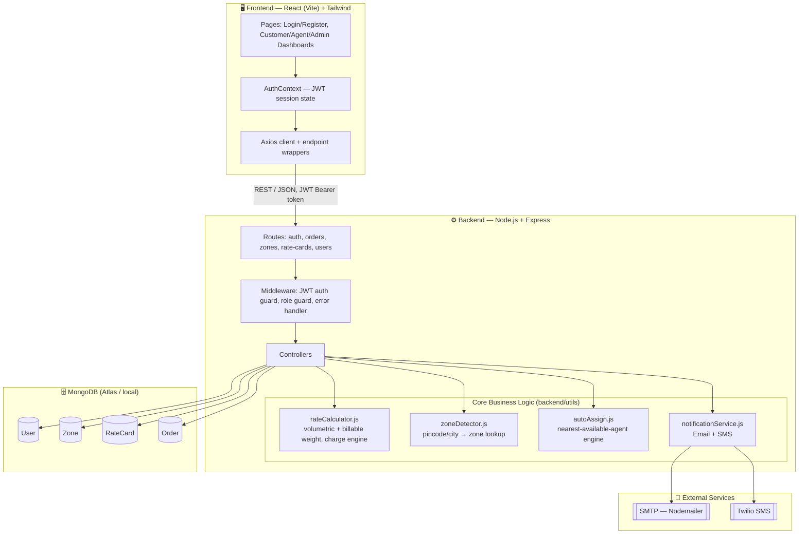
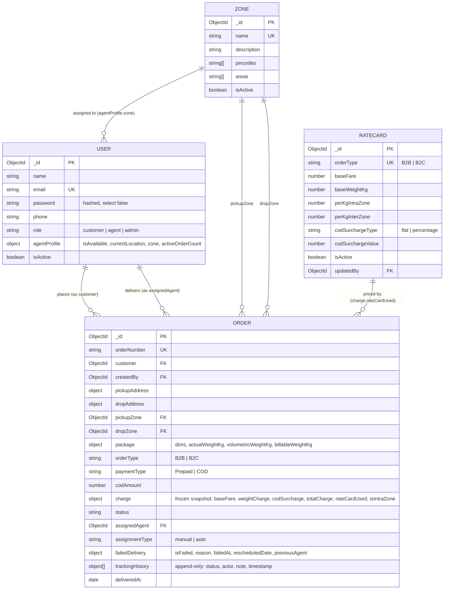

<div align="center">

# 📦 Last-Mile Delivery Tracker

A full-stack **MERN** delivery management platform — customers and admins create orders with
auto-calculated shipping charges, agents are assigned intelligently (manual or
nearest-available auto-assignment), and customers get notified by email/SMS at every status
change.

[](https://your-live-app-url.vercel.app)
[](https://your-live-app-url.vercel.app)
[](https://github.com/VaishnaviUbarhande/-lastmile-delivery-tracker)

<br/>


**[🔗 Live App](#-live-demo) · [✨ Features](#-features) · [🏗 Architecture](#-architecture) · [🗄 Database Schema](#-database-schema) · [⚙️ Environment Variables](#️-environment-variables) · [🚀 Setup](#-local-setup)**

</div>

> ⚠️ **Before publishing:** search this file for `⬅️ REPLACE` and swap in your real Vercel/Render URLs (2 spots total).

---

## 🔗 Live Demo

This project is **connected to GitHub for CI and to Vercel for continuous deployment** — every
push to `main` auto-deploys the frontend.

| Part | Status | URL | Hosted On |
|------|:---:|-----|-----------|
| 🌐 Frontend (App) | 🟢 Live | **[your-app-name.vercel.app](https://your-app-name.vercel.app)** ⬅️ REPLACE | Vercel |
| ⚙️ Backend (API) | 🟢 Live | **[your-api-name.onrender.com/api](https://your-api-name.onrender.com/api)** ⬅️ REPLACE | Render / Railway |
| 📦 Source Code | — | [github.com/VaishnaviUbarhande/-lastmile-delivery-tracker](https://github.com/VaishnaviUbarhande/-lastmile-delivery-tracker) | GitHub |

> Log in with any of the seeded demo accounts below to explore the app right away — no
> registration needed.

| Role | Email | Password |
|------|-------|----------|
| 🛡️ Admin | `admin@lastmile.com` | `Admin@12345` |
| 🚴 Agent | `ravi.agent@lastmile.com` | `Agent@12345` |
| 🚴 Agent | `priya.agent@lastmile.com` | `Agent@12345` |
| 👤 Customer | `customer@lastmile.com` | `Customer@12345` |

---

## 📸 Screenshots

| Login Page | Customer — Create New Order |
|---|---|
|  |  |

| Customer — My Orders | Customer — My Orders (Multiple) |
|---|---|
|  |  |

| Delivery Agent Dashboard | Admin — Order Management |
|---|---|
|  |  |

---

## ✨ Features

### 👤 Customer
- Register/login with JWT-based auth
- Create an order with live shipping-price preview before confirming
- Track order status on a visual timeline (Created → Assigned → Picked Up → In Transit → Out for Delivery → Delivered/Failed)
- Request a reschedule after a failed delivery attempt
- View past orders and their frozen (never-changing) price breakdown

### 🚴 Delivery Agent
- View orders assigned to them
- Update order status through a strict, validated state machine
- Mark a delivery as failed with a reason (triggers customer notification)
- Toggle availability and current location for auto-assignment

### 🛡️ Admin
- Full order oversight with manual re-assignment / override
- Manage **Zones** — map pincodes/areas to logistics zones (no code changes needed)
- Manage **Rate Cards** — edit B2B/B2C pricing (base fare, per-kg rate, COD surcharge) live
- Manage users (view/deactivate customers & agents)
- See auto-assignment "widened search" flags when a zone runs out of available agents

### ⚙️ Platform-wide
- 🧮 **Dynamic pricing engine** — volumetric weight, billable weight, intra/inter-zone rates, COD surcharge — 100% database-driven, zero hardcoded prices
- 🤖 **Smart auto-assignment** — nearest-available agent by Haversine distance with load-balancing fallback
- 🔁 **Failed-delivery & reschedule flow** with automatic re-assignment
- 🧾 **Append-only audit trail** (`trackingHistory`) — every status change is timestamped and attributed to the actor who made it
- 📧 **Email + SMS notifications** (Nodemailer + Twilio) on every status change, with a `DRY_RUN` mode for local dev without credentials
- 🔒 Role-based route protection (customer / agent / admin) via JWT + middleware guards
- ✅ Jest + Supertest test suite (rate engine unit tests + full order-lifecycle integration test) using an in-memory MongoDB

---

## 🏗 Architecture



**Request flow example — creating an order:**

`Customer Dashboard` → `POST /api/orders/preview` → `zoneDetector` resolves pickup/drop zone →
`rateCalculator` computes volumetric weight → billable weight → charge breakdown → price shown
to customer → on confirm, `POST /api/orders` **re-runs the same calculation server-side**
(never trusts the previewed price from the client) → `autoAssign` picks the nearest available
agent → order + frozen `charge` snapshot + first `trackingHistory` entry saved to MongoDB →
`notificationService` emails/texts the customer.

---

## ⚙️ Environment Variables

### Backend (`backend/.env`)

| Variable | Example | Purpose |
|---|---|---|
| `PORT` | `5000` | Port the Express server listens on |
| `NODE_ENV` | `development` | Enables/disables dev-only behavior (verbose errors, logging) |
| `CLIENT_URL` | `http://localhost:5173` | Allowed origin for CORS — must match the deployed frontend URL in production |
| `MONGO_URI` | `mongodb://127.0.0.1:27017/lastmile` | MongoDB connection string (local or Atlas SRV URI) |
| `JWT_SECRET` | *(long random string)* | Secret key used to sign/verify JWT auth tokens — **keep private, never commit** |
| `JWT_EXPIRES_IN` | `7d` | How long an issued JWT stays valid before the user must log in again |
| `SMTP_HOST` | `smtp.gmail.com` | SMTP server host used by Nodemailer to send order-status emails |
| `SMTP_PORT` | `587` | SMTP server port (587 = STARTTLS) |
| `SMTP_SECURE` | `false` | Whether to use implicit TLS (`true` for port 465, `false` for 587) |
| `SMTP_USER` | `your_email@gmail.com` | SMTP account username used to authenticate outgoing email |
| `SMTP_PASS` | `your_app_password` | SMTP account password / app password |
| `EMAIL_FROM` | `"Last-Mile Tracker <no-reply@lastmile.com>"` | "From" name/address shown on notification emails |
| `TWILIO_ACCOUNT_SID` | `ACxxxxxxxxxxxxxxxxxxxxxxxxxxxxxxxx` | Twilio account identifier used to send SMS notifications |
| `TWILIO_AUTH_TOKEN` | `your_twilio_auth_token` | Twilio auth token — **keep private, never commit** |
| `TWILIO_PHONE_NUMBER` | `+1xxxxxxxxxx` | Twilio sender phone number that SMS notifications are sent from |
| `NOTIFICATIONS_DRY_RUN` | `true` | When `true`, skips real email/SMS sending and just logs to console — lets you run the app locally without any SMTP/Twilio credentials |
| `SEED_ADMIN_EMAIL` | `admin@lastmile.com` | Email used for the admin account created by `npm run seed` |
| `SEED_ADMIN_PASSWORD` | `Admin@12345` | Password used for the seeded admin account — change before any real deployment |

### Frontend (`frontend/.env`)

| Variable | Example | Purpose |
|---|---|---|
| `VITE_API_BASE_URL` | `http://localhost:5000/api` | Base URL the React app uses for every backend API call — point this at your deployed backend's `/api` path in production |

> 💡 Copy `.env.example` → `.env` in both `backend/` and `frontend/`, then fill in real values.
> `.env` files are git-ignored and should never be committed.

---

## 🗄 Database Schema

MongoDB / Mongoose, 4 collections. `Order` is the central document, referencing `User` (customer
+ agent) and `Zone` (pickup + drop), and snapshotting the `RateCard` used at creation time.



### Collection reference

| Collection | Purpose | Key fields & notes |
|---|---|---|
| **User** | Stores all three account types in one collection, differentiated by `role`. | `password` is bcrypt-hashed and excluded from queries by default (`select: false`). Agents carry an embedded `agentProfile` (availability, live lat/lng, home zone, `activeOrderCount`) used entirely by the auto-assignment engine. Indexed on `role` and on `agentProfile.zone` + `agentProfile.isAvailable` for fast candidate lookup. |
| **Zone** | Admin-defined mapping of pincodes/areas → a named logistics zone. | A pincode may only belong to one *active* zone — enforced in the controller (not the schema, since Mongo doesn't do cross-document uniqueness natively). Drives both zone detection and intra/inter-zone pricing. |
| **RateCard** | One active pricing document per `orderType` (B2B or B2C). | Fully admin-editable from the dashboard — no price is ever hardcoded in application code. `codSurchargeType` decides whether the COD surcharge is a flat fee or a percentage of the freight subtotal. |
| **Order** | The central transactional record — one per shipment. | `charge` is a **frozen snapshot** taken at creation time (including which `RateCard` doc was used), so a later rate-card edit never changes the price of a historical order. `trackingHistory[]` is **append-only** — a full, timestamped, actor-attributed audit trail that both the customer timeline UI and admin tooling read from directly. `failedDelivery` holds everything needed to support the reschedule flow. |

---

## 🧮 Rate Calculation Logic

1. **Zone detection** — pickup/drop pincode is looked up against the `Zone` collection; city name is a fallback if no pincode match exists.
2. **Volumetric weight** = `(L × B × H in cm) / 5000` — the industry-standard courier divisor.
3. **Billable weight** = `max(actualWeightKg, volumetricWeightKg)`.
4. **Rate card lookup** — the active `RateCard` for the order's `orderType` (B2B/B2C) is fetched, never hardcoded.
5. **Weight charge** = `max(0, billableWeight − baseWeightKg) × (perKgIntraZone or perKgInterZone)`, chosen by whether pickup/drop zones match.
6. **COD surcharge** — added only if `paymentType === 'COD'`: flat amount or a percentage of `(baseFare + weightCharge)`.
7. **Total** = `baseFare + weightCharge + codSurcharge`. This exact breakdown is returned by `/api/orders/preview` and **re-computed server-side** (never trusted from the client) at `/api/orders` creation — so the confirmed price can never be spoofed by the frontend.

## 🤖 Auto-Assignment Logic

1. Candidate pool = agents with `isAvailable = true` in the order's pickup zone.
2. If candidates report a location, rank by Haversine distance to pickup; ties broken by lowest `activeOrderCount` (load balancing).
3. No location data → rank by lowest `activeOrderCount` only.
4. Zero agents available in-zone → search widens system-wide (`widenedSearch: true` flagged in the response) rather than leaving the order unassignable.
5. `activeOrderCount` is incremented/decremented on assignment/reassignment, doubling as a live load counter.

## 🔁 Failed Delivery & Reschedule Flow

1. Agent marks an order `Failed` with a reason → `failedDelivery` populated, customer notified, tracking history appended.
2. Customer/admin calls `/api/orders/:id/reschedule` → order moves to `Rescheduled`, auto-assignment re-runs immediately for the new attempt.
3. Agent progresses the order through the same status pipeline again: `Picked Up → In Transit → Out for Delivery → Delivered/Failed`.

---

## 🧰 Tech Stack

| Layer | Technology |
|---|---|
| Frontend | React 18 (Vite), React Router, Tailwind CSS, Axios, react-hot-toast |
| Backend | Node.js, Express 4, Mongoose 8 |
| Database | MongoDB (local or Atlas) |
| Auth | JWT (jsonwebtoken) + bcryptjs password hashing |
| Notifications | Nodemailer (email), Twilio (SMS) |
| Security | Helmet, express-rate-limit, express-validator |
| Testing | Jest, Supertest, mongodb-memory-server |
| Deployment targets | Vercel (frontend), Render/Railway (backend), MongoDB Atlas (database) |

## 📁 Project Structure

```
lastmile-delivery-tracker/
├── backend/
│   ├── config/db.js                 # MongoDB connection
│   ├── models/                      # User, Zone, RateCard, Order (with immutable trackingHistory)
│   ├── controllers/                 # auth, zone, rateCard, order, user
│   ├── routes/                      # REST route definitions
│   ├── middleware/                  # JWT auth + role guard, error handler
│   ├── utils/
│   │   ├── rateCalculator.js        # volumetric weight, billable weight, charge engine
│   │   ├── zoneDetector.js          # pincode/city -> zone lookup
│   │   ├── autoAssign.js            # nearest-available-agent engine
│   │   └── notificationService.js   # Email (Nodemailer) + SMS (Twilio)
│   ├── seed/seed.js                 # seeds admin, 2 zones, 2 rate cards, 2 agents, 1 customer
│   ├── tests/                       # Jest unit + supertest integration tests
│   ├── server.js
│   ├── package.json
│   └── .env.example
├── frontend/
│   ├── src/
│   │   ├── api/                     # axios client + endpoint wrappers
│   │   ├── context/AuthContext.jsx  # JWT session state
│   │   ├── components/              # Navbar, StatusBadge, OrderTimeline, ProtectedRoute
│   │   └── pages/                   # Login, Register, Customer/Agent/Admin dashboards
│   ├── package.json
│   └── .env.example
├── SYSTEM_DESIGN.md
├── API_DOCUMENTATION.md
└── README.md   (this file)
```

## 🚀 Local Setup

### Prerequisites
- Node.js 18+
- MongoDB (local install OR a free MongoDB Atlas cluster)
- *(Optional)* an SMTP account (Gmail App Password, Brevo, Mailtrap) and a free Twilio trial account. Without these, set `NOTIFICATIONS_DRY_RUN=true` and notifications just log to console — the rest of the app works fully.

### Backend
```bash
cd backend
cp .env.example .env
# edit .env: set MONGO_URI, JWT_SECRET, and (optionally) SMTP/Twilio credentials
npm install
npm run seed     # creates admin, 2 zones, 2 rate cards, 2 agents, 1 test customer
npm run dev      # starts on http://localhost:5000
```

### Frontend
```bash
cd frontend
cp .env.example .env
# edit .env: set VITE_API_BASE_URL=http://localhost:5000/api
npm install
npm run dev       # starts on http://localhost:5173
```

Open `http://localhost:5173` and log in with any seeded account (see [Live Demo](#-live-demo) table above), or register a new customer.

### Running Tests (backend)
```bash
cd backend
npm test
```
Uses `mongodb-memory-server` (in-process MongoDB), so no external database is needed. Covers the rate calculation engine (volumetric weight, intra/inter-zone pricing, COD surcharge) and a full order-lifecycle integration flow (create → assign → status transitions → failed delivery → reschedule → auto-reassignment → admin override).

## 📡 API Reference

Full endpoint-by-endpoint documentation (request/response bodies, auth requirements) lives in
[`API_DOCUMENTATION.md`](./API_DOCUMENTATION.md).

## ☁️ Deployment

- **Database** — create a free MongoDB Atlas cluster → allow-list `0.0.0.0/0` (or your host's egress IPs) → copy the SRV connection string into `MONGO_URI`.
- **Backend** → Render or Railway
  - Build command: `npm install`
  - Start command: `npm start`
  - Set all variables from `backend/.env.example` in the host's environment settings
  - After first deploy, run `npm run seed` once (via the host's shell) to create the admin
- **Frontend** → Vercel
  - Framework preset: Vite
  - Set `VITE_API_BASE_URL` to your deployed backend's `/api` URL
  - Update the backend's `CLIENT_URL` env var to the deployed frontend URL (used for CORS)

More detail in [`SYSTEM_DESIGN.md`](./SYSTEM_DESIGN.md) §5.

## 📝 Notes

- No pricing, zone, or assignment logic is hardcoded — it's all driven by the `Zone` and `RateCard` collections, editable by an admin with zero code changes.
- Every frontend page calls real backend REST endpoints — no mock/fake data in the application itself. `seed/seed.js` only seeds *configuration* (admin login, zones, rate cards, two agents), not fake orders.

---

<div align="center">

Built with ❤️ using the MERN stack — [API Docs](./API_DOCUMENTATION.md) · [System Design](./SYSTEM_DESIGN.md)

</div>
