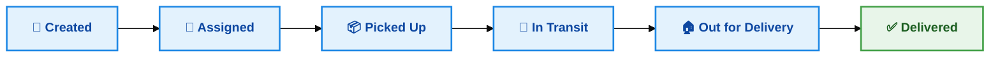
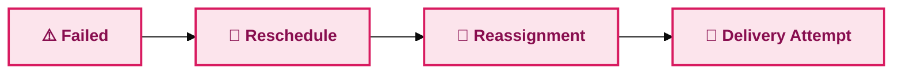
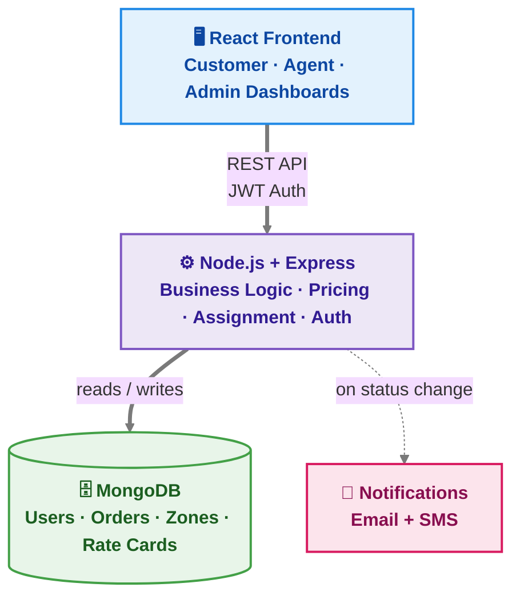

<div align="center">

# 📦 Last-Mile Delivery Tracker

### 🚚 Full-Stack MERN Delivery Management Platform

A full-stack logistics platform that helps **customers create and track deliveries**, **delivery agents manage shipments**, and **admins manage orders, pricing, zones, and assignments** — with shipping charges calculated automatically and orders intelligently routed to the nearest available agent.

[](https://lastmile-delivery-tracker-kyyq-ks6zhgjn2-vaishnavi-0c1c.vercel.app/)


**[🌐 Live Demo](#-live-demo) · [🚀 Key Features](#-key-features) · [🏗️ Architecture](#️-system-architecture) · [🧮 Smart Pricing](#-smart-pricing-system) · [▶️ Run Locally](#️-run-locally) · [🔐 Demo Accounts](#-demo-accounts)**

</div>

---

## 📑 Table of Contents

1. [About the Project](#-about-the-project)
2. [Problem Statement](#-problem-statement)
3. [Key Features](#-key-features)
4. [Smart Pricing System](#-smart-pricing-system)
5. [Smart Delivery Agent Assignment](#-smart-delivery-agent-assignment)
6. [Delivery Lifecycle](#-delivery-lifecycle)
7. [System Architecture](#️-system-architecture)
8. [Tech Stack](#️-tech-stack)
9. [Screenshots](#-screenshots)
10. [Demo Accounts](#-demo-accounts)
11. [Project Structure](#-project-structure)
12. [Run Locally](#️-run-locally)
13. [Testing](#-testing)
14. [Security](#-security)
15. [Documentation](#-documentation)

---

## 🎯 About the Project

**Last-Mile Delivery Tracker** is a MERN-based delivery management system built to simplify the complete delivery lifecycle — from order creation to final delivery.

It ships with three purpose-built dashboards:

| Role | What they can do |
|---|---|
| 👤 **Customer** | Create and track orders, see live price previews, view delivery timelines |
| 🚴 **Delivery Agent** | Manage assigned deliveries, update status, toggle availability |
| 🛡️ **Admin** | Manage orders, agents, zones, and pricing across the whole platform |

Shipping costs are calculated automatically from **package weight, dimensions, delivery zone, order type, and payment type** — and the system auto-assigns the nearest available delivery agent, tracks status changes end-to-end, and handles failed-delivery rescheduling and notifications.

---

## 💡 Problem Statement

Traditional delivery management relies on manual work for:

- ❌ Calculating shipping charges
- ❌ Assigning delivery agents
- ❌ Tracking delivery status
- ❌ Managing failed deliveries
- ❌ Maintaining pricing and zone information

**Last-Mile Delivery Tracker replaces all of this with one automated, centralized platform.**

---

## 🚀 Key Features

<table>
<tr>
<td valign="top" width="33%">

### 👤 Customer
- Secure register & login
- Create new delivery orders
- **Live shipping-price preview**
- View all orders
- Track status on a visual timeline
- View full price breakdown
- Request reschedule after a failed delivery

</td>
<td valign="top" width="33%">

### 🚴 Delivery Agent
- View assigned orders
- Update delivery status
- Mark delivery as failed (with reason)
- Toggle availability
- Update current location
- Receive auto-reassigned orders

</td>
<td valign="top" width="33%">

### 🛡️ Admin
- View all customer orders
- Assign / reassign agents
- Manage delivery agents
- Manage delivery zones
- Manage B2B / B2C pricing
- Activate / deactivate users
- Monitor tracking history

</td>
</tr>
</table>

### ⚙️ Smart Backend Features

| | |
|---|---|
| 🧮 Automatic shipping-price calculation | 📦 Volumetric & billable weight logic |
| 📍 Zone-based pricing | 🤖 Nearest-agent auto-assignment |
| ⚖️ Agent load balancing | 🔁 Failed-delivery & reschedule workflow |
| 🧾 Full order tracking history | 🔐 JWT auth + role-based authorization |
| 📧 Email / SMS notifications | ✅ API testing with Jest + Supertest |

---

## 🧮 Smart Pricing System

Shipping charges are calculated automatically — no hardcoded prices anywhere.

**Volumetric Weight**
```text
Volumetric Weight = (Length × Width × Height) / 5000
```

**Billable Weight**
```text
Billable Weight = MAX(Actual Weight, Volumetric Weight)
```

**Final Price**
```text
Total = Base Fare + Weight Charge + COD Surcharge
```

Pricing lives in the database via **Rate Cards**, so admins can update prices anytime without touching code.

---

## 🤖 Smart Delivery Agent Assignment

When an order is created, the backend automatically searches for the best available delivery agent, weighing:

1. 🟢 Agent availability
2. 📍 Pickup zone
3. 📏 Distance from pickup location
4. 📊 Current active-delivery load

The **nearest, least-loaded** suitable agent is selected. If no agent is available in the pickup zone, the search automatically widens to other available agents system-wide.

---

## 🔄 Delivery Lifecycle



**If a delivery fails:**



Every single status change is written to the order's tracking history — nothing is ever overwritten.

---

## 🏗️ System Architecture



**Request flow — placing an order:**

`Customer Dashboard` → `POST /api/orders/preview` → zone lookup resolves pickup/drop zone → price calculated (volumetric weight → billable weight → charge breakdown) → shown to customer → on confirm, `POST /api/orders` **re-runs the calculation server-side** (client price is never trusted) → nearest available agent auto-assigned → order + frozen price snapshot saved to MongoDB → customer notified by email/SMS.

---

## 🛠️ Tech Stack

| Category | Technologies |
|---|---|
| **Frontend** | React.js, Vite, Tailwind CSS, React Router |
| **Backend** | Node.js, Express.js |
| **Database** | MongoDB, Mongoose |
| **Authentication** | JWT, bcryptjs |
| **API Communication** | Axios, REST APIs |
| **Notifications** | Nodemailer, Twilio |
| **Security** | Helmet, Rate Limiting, Express Validator |
| **Testing** | Jest, Supertest, MongoDB Memory Server |
| **Deployment** | Vercel, Render/Railway, MongoDB Atlas |
| **Version Control** | Git, GitHub |

---

## 📸 Screenshots

A few screens from the running application, covering the customer, delivery agent, and admin experiences.

| **Login Page** | **Customer — New Order** |
|---|---|
|  |  |

| **Customer — My Orders** | **Customer — Multiple Orders** |
|---|---|
|  |  |

| **Delivery Agent Dashboard** | **Admin — Order Management** |
|---|---|
|  |  |

> 💡 Keep the `screenshots/` folder in the same directory as this README when pushing to GitHub — it's how these images render.

---

## 🔐 Demo Accounts

| Role | Email | Password |
|---|---|---|
| 🛡️ Admin | `admin@lastmile.com` | `Admin@12345` |
| 🚴 Agent | `ravi.agent@lastmile.com` | `Agent@12345` |
| 🚴 Agent | `priya.agent@lastmile.com` | `Agent@12345` |
| 👤 Customer | `customer@lastmile.com` | `Customer@12345` |

**🌐 Live Application:** [lastmile-delivery-tracker-kyyq-ks6zhgjn2-vaishnavi-0c1c.vercel.app](https://lastmile-delivery-tracker-kyyq-ks6zhgjn2-vaishnavi-0c1c.vercel.app/)

---

## 📁 Project Structure

```text
lastmile-delivery-tracker/
│
├── backend/
│   ├── controllers/
│   ├── models/
│   ├── routes/
│   ├── middleware/
│   ├── utils/
│   ├── seed/
│   ├── tests/
│   └── server.js
│
├── frontend/
│   ├── src/
│   │   ├── api/
│   │   ├── components/
│   │   ├── context/
│   │   └── pages/
│   └── package.json
│
├── screenshots/
├── SYSTEM_DESIGN.md
├── API_DOCUMENTATION.md
└── README.md
```

---

## ▶️ Run Locally

### 1️⃣ Clone the repository
```bash
git clone https://github.com/VaishnaviUbarhande/-lastmile-delivery-tracker.git
cd -lastmile-delivery-tracker
```

### 2️⃣ Start the backend
```bash
cd backend
npm install
npm run seed
npm run dev
```
Backend runs on → `http://localhost:5000`

### 3️⃣ Start the frontend
Open a new terminal:
```bash
cd frontend
npm install
npm run dev
```
Frontend runs on → `http://localhost:5173`

---

## 🧪 Testing

```bash
cd backend
npm test
```

Covers:
- ✅ Pricing calculations
- ✅ Order creation
- ✅ Agent assignment
- ✅ Delivery status updates
- ✅ Failed delivery
- ✅ Rescheduling
- ✅ Full order lifecycle

---

## 🔒 Security

- 🔐 JWT-based authentication
- 🔑 Password hashing with bcrypt
- 🛡️ Role-based authorization
- 🚧 Protected API routes
- ⏱️ Request rate limiting
- 🪖 Helmet security headers
- 💰 Server-side price validation (never trusts the client)
- 🌱 Environment-variable-based secrets

---

## 📚 Documentation

- [`SYSTEM_DESIGN.md`](SYSTEM_DESIGN.md) — System architecture & design decisions
- [`API_DOCUMENTATION.md`](API_DOCUMENTATION.md) — Full REST API reference

---

<div align="center">

## 🌐 Try It Live

**[🚀 Open Last-Mile Delivery Tracker →](https://lastmile-delivery-tracker-kyyq-ks6zhgjn2-vaishnavi-0c1c.vercel.app/)**

### Built with ❤️ using the MERN Stack
**React • Node.js • Express • MongoDB**

</div>
